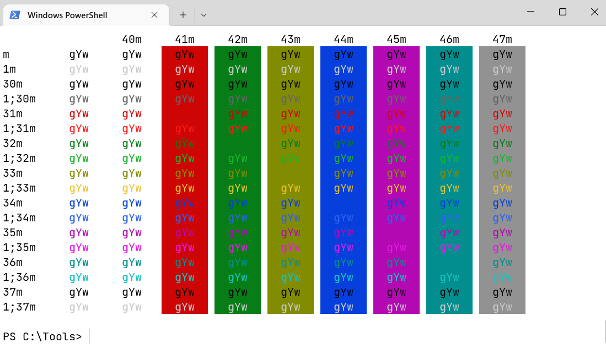

# IntelliJ Light Color Scheme for [Windows Terminal](https://github.com/microsoft/terminal)
A port of the [IntelliJ Light](https://plugins.jetbrains.com/plugin/12697-intellij-light-theme) for [Windows Terminal](https://github.com/microsoft/terminal).





## Install

In the `settings.json` settings file for Windows Terminal, find the `schemes` section and add a new color scheme:

```json
{
    "name": "IntelliJ Light",
    "foreground": "#000000",
    "background": "#FFFFFF",
    "selectionBackground": "#A6D2FF",
    "cursorColor": "#000000",
    "black": "#000000",
    "blue": "#063FDB",
    "cyan": "#028E8E",
    "green": "#067D17",
    "purple": "#B309B3",
    "red": "#CE0505",
    "white": "#929292",
    "brightBlack": "#656565",
    "brightBlue": "#2D61F0",
    "yellow": "#828C00",
    "brightCyan": "#15C1C1",
    "brightGreen": "#16B42C",
    "brightPurple": "#E617E6",
    "brightRed": "#FF1616",
    "brightWhite": "#C9C9C9",
    "brightYellow": "#ECC32C"   
}
```

To make Windows Terminal more similar to IntelliJ you should also install and change font to [`Jetbrains Mono`](https://www.jetbrains.com/lp/mono/)

## License

[MIT License](./LICENSE)